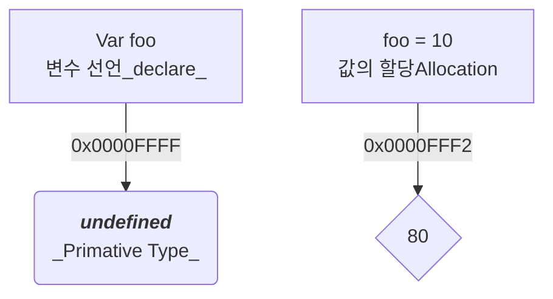

# Tools

- Marpit(ppt ) marp tutorial - Never use PowerPoint again

    https://youtu.be/EzQ-p41wNEE

    - Marpit /mɑːrpɪt/ is the skinny framework for creating slide deck from Markdown. It can transform Markdown and CSS theme(s) to slide deck composed of static HTML and CSS and create a web page convertible into slide PDF by printing

    https://marpit.marp.app/

    https://github.com/YoungHaKim7/marp_project

- Mermaid

  - Diagramming and charting tool https://mermaid.js.org/

<hr>

# Modern JavaScript(Deep Dive)

https://poiemaweb.com/


# 인터프리터 언어 (JavaScript)

- 인터프리터 언어(Interpreter Language) vs 컴파일 언어(Compiled Language)

<table border="1">
    <tr>
    <td colspan="2" align="center">Interpreter  VS.   Compiled</td>
    </tr>
    <tr align="center">
        <td>인터프리터 언어<br>(Interpreter Language</td>
        <td>컴파일 언어<br>(Compiled Language)</td>
    </tr>
    <tr align="center">
        <td>JavaScript<br>Python</td>
        <td> C, C++ </td>
    </tr>
    <tr align="center">
        <td>JavaScript<br>Declare(변수 선언)<br>Allocation은 Runtime때</td>
        <td>Compiled 에 대부분 다 해결<br>일부 Polymorphism은 Runtime때</td>
    </tr>
</table>

<hr>

# 모던 자바스크립트 저자 유튜브 강의 변수 시리즈

https://youtube.com/playlist?list=PLkNVwwEe58DjmO5kTUkfm-8NEDUKG2No5


# JS_ 변수는 선언하면

- 선언 Declare -> undefined 로 메모리 주소로 할당
  - undefined 는 primitive type 이다.
    - https://developer.mozilla.org/en-US/docs/Glossary/Primitive
    - https://developer.mozilla.org/en-US/docs/Web/JavaScript/Reference/Global_Objects/undefined 

- 할당 allocation 하면 새로운 주소값 할당 (allocation은 Runtime에서 실행됨)

```javascript
function test(t) {
  if (t === undefined) {
    return 'Undefined value!';
  }
  return t;
}

let x; // Delare

console.log(test(x)); 
// Expected output: "Undefined value!"

x = 10; // allocation
```

# Hoising 개념 잡기

https://developer.mozilla.org/en-US/docs/Glossary/Hoisting


# 5.29 Array_자바스크립트 배열은 배열이 아니다

https://poiemaweb.com/js-array-is-not-arrray?fbclid=IwAR2BbwtwAsunP-vXZCIT9smB4eJEMfRRg0h_g3trK192omvaqV0ykGyWml4&mibextid=Zxz2cZ

# JavaScript는 선언 할당 개념이 완전히 틀리다. 주의 !! Declare & allocation



https://felixgerschau.com/javascript-memory-management/

https://developer.mozilla.org/en-US/docs/Web/JavaScript/Memory_Management
